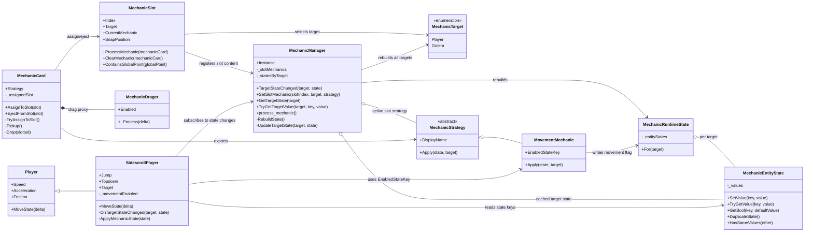

# Dynamic Mechanics System

## Overview

The current Dynamic Mechanics System is a small data-driven pipeline that turns draggable mechanic cards into runtime state for a chosen target.

The important design choice is that the system is no longer movement-specific. `MechanicStrategy`, `MechanicManager`, `MechanicCard`, and `MechanicSlot` do not know what a mechanic means in gameplay terms. They only know how to:

- carry a mechanic resource,
- assign that resource to a target through a slot,
- rebuild per-target mechanic state,
- notify runtime consumers that the target state changed.

At the moment, the only implemented concrete mechanic is `MovementMechanic`, and the only runtime consumer is `SidescrollPlayer`.

## Class Diagram

## How The System Works

### 1. Mechanic behavior is stored in a resource

Every mechanic is represented by a `MechanicStrategy` resource. The base class only exposes a display name and one operation: `Apply(state, target)`.

That means a mechanic does not directly move a node, spawn a scene, or modify physics bodies by itself. Instead, it writes its intent into a generic runtime state object.

Right now, `MovementMechanic` is the only concrete implementation. When applied, it writes the `movement_enabled` key into the state for the selected `MechanicTarget`.

### 2. Cards are only carriers for strategies

`MechanicCard` is a draggable `RigidBody2D` with an exported `Strategy` resource.

The card is intentionally mechanic-agnostic:

- it does not know what movement means,
- it does not know what a spawner or reaction mechanic would do,
- it only handles pickup, dragging, dropping, and slot assignment.

The actual movement card is created by scene/resource wiring:

- `objects/mechanic/mechanic.tscn` instantiates `MechanicCard`,
- `resources/mechanic/movement_mechanic.tres` assigns a concrete `MovementMechanic` resource to its `Strategy` export.

This is important because future cards can reuse the same `MechanicCard` class and just swap the resource.

### 3. Slots bind a card to a target

`MechanicSlot` represents a place in the programming UI where a card can be dropped.

Each slot has:

- an `Index`, used for deterministic ordering,
- a `Target`, which decides whether the mechanic applies to `Player` or `Golem`,
- a reference to the currently assigned card.

When a card is dropped onto a slot:

1. the slot validates that the card has a strategy,
2. the slot finds `MechanicManager`,
3. the slot stores the card locally,
4. the slot calls `MechanicManager.SetSlotMechanic(Index, Target, Strategy)`.

When the card is picked up again, the slot is cleared and the manager is updated with `null`.

### 4. The manager rebuilds target state from scratch

`MechanicManager` is the system's central runtime authority.

It stores active slot contents in `_slotMechanics`, keyed by slot index. Whenever a slot changes, the manager does not try to patch the old result incrementally. Instead, it rebuilds the whole runtime state:

1. create a fresh `MechanicRuntimeState`,
2. iterate active slot mechanics in sorted slot order,
3. call `Strategy.Apply(...)` for each entry,
4. compare the rebuilt state against the cached state for each target,
5. emit `TargetStateChanged` only for targets whose state actually changed.

This rebuild-from-scratch approach keeps the system simple and deterministic. It also makes stacking multiple mechanics per target easier later, because the final state is always derived from the current slot layout.

### 5. Runtime consumers interpret only the keys they care about

`MechanicEntityState` is just a generic key/value bag backed by `StringName -> Variant`.

That means the manager does not know what any particular key means. It only stores, duplicates, compares, and distributes target state.

Concrete gameplay nodes interpret the keys:

- `SidescrollPlayer` subscribes to `MechanicManager.TargetStateChanged`,
- it also pulls the current state once in `_Ready()` so it starts in sync,
- it reads `MovementMechanic.EnabledStateKey`,
- it sets its private `_movementEnabled` flag from that value,
- `MoveState()` early-outs when movement is not enabled.

So the dependency direction is deliberate:

- strategies write generic state,
- the manager distributes generic state,
- gameplay consumers decide how to interpret that state.

## Scene And Resource Wiring

The current programming setup is assembled like this:

- `scenes/programming.tscn` instantiates one mechanic card scene and two slot instances.
- The first slot targets `Player`.
- The second slot targets `Golem`.
- `objects/slot.tscn` provides the reusable slot UI and binds it to `MechanicSlot`.
- `objects/mechanic/mechanic.tscn` provides the reusable card scene and binds it to `MechanicCard`.
- `resources/mechanic/movement_mechanic.tres` makes that reusable card scene a concrete movement card.

That is why the class diagram alone is not enough: the class layer is generic, but the actual mechanic type currently comes from scene/resource composition.

## Current Extension Pattern

To add another mechanic under the current architecture:

1. Create a new class that inherits `MechanicStrategy`.
2. Define one or more state keys that the mechanic writes into `MechanicRuntimeState`.
3. Create a `.tres` resource instance for that strategy.
4. Attach that resource to a `MechanicCard` scene instance.
5. Add or update a gameplay consumer that listens to `MechanicManager` and interprets the new key(s).

For example, a future yellow spawner mechanic should still fit this model:

- the card stays generic,
- the slot stays generic,
- the manager stays generic,
- only the new strategy resource and the node that consumes its state need mechanic-specific logic.

## Practical Summary

The current Dynamic Mechanics System is not a direct action system. It is a state assembly system.

Cards choose strategies.
Slots assign strategies to targets.
The manager rebuilds target state.
Gameplay nodes consume the resulting state.

That separation is what makes the current implementation generic enough to support more mechanics than movement.
